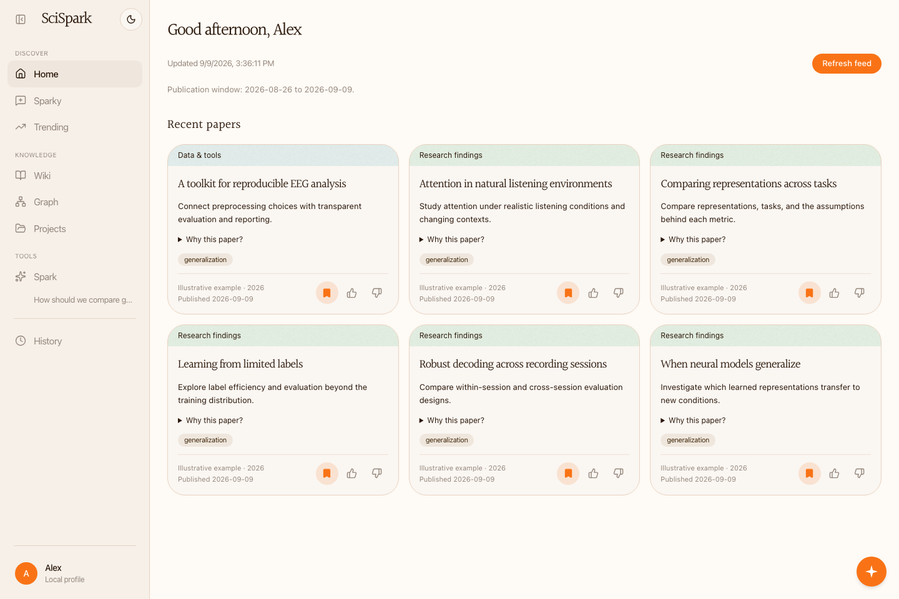
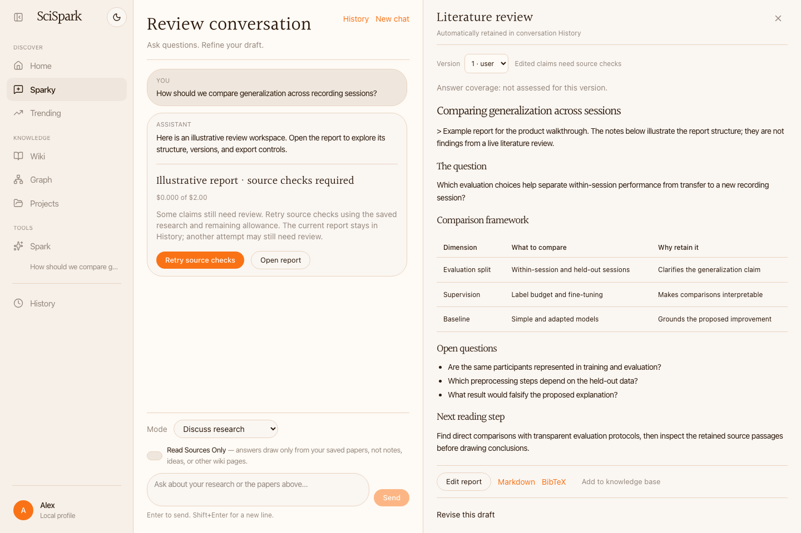
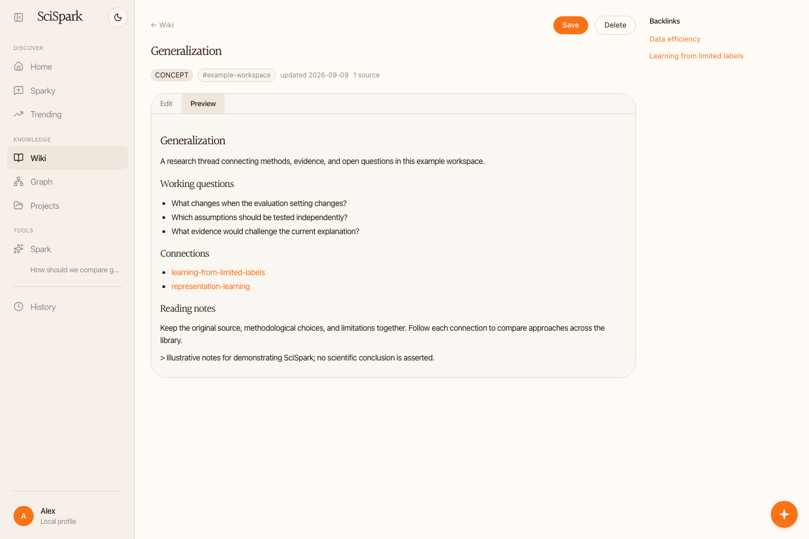
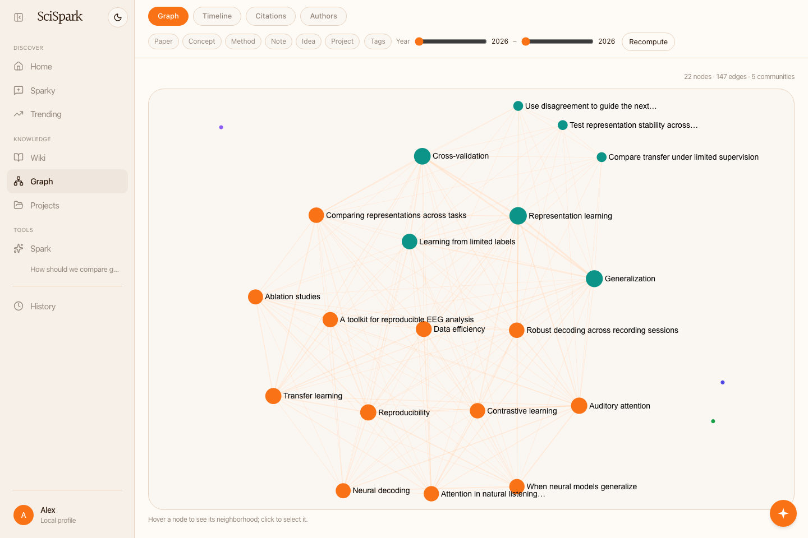
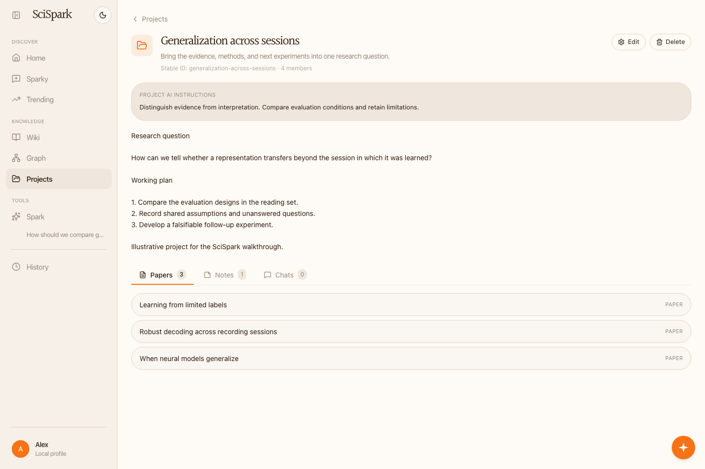
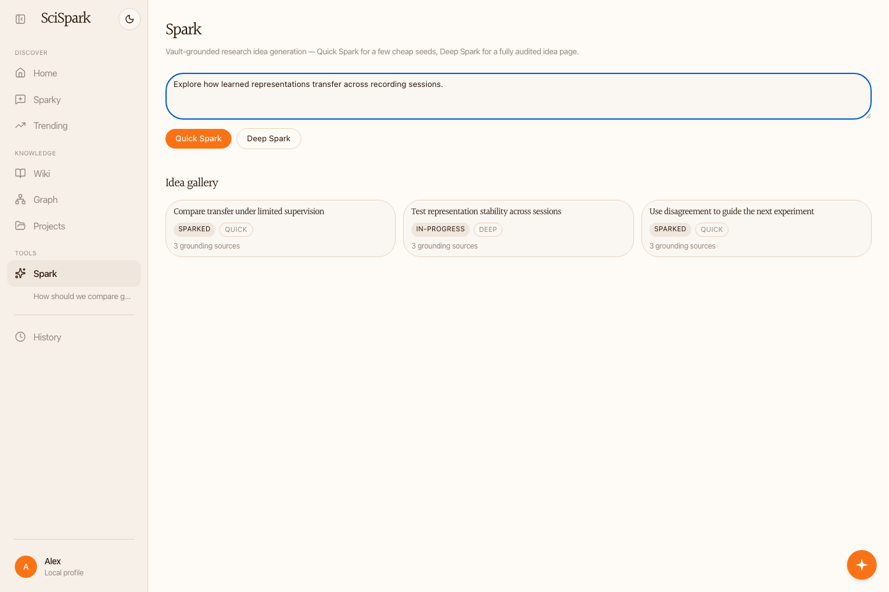
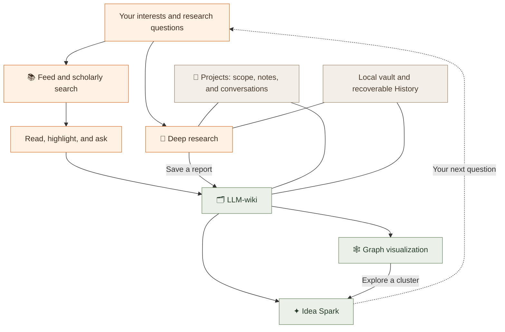
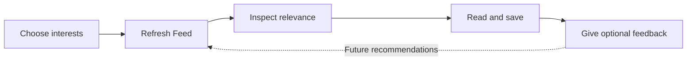
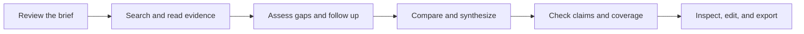
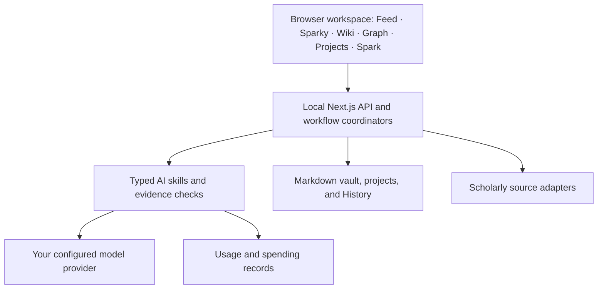

<a id="top"></a>

<div align="center">

# ✦ SciSpark

### From the paper you discover to the question you ask next.

A personal workspace to **discover papers, build knowledge, and explore ideas**.

[](#current-preview)
[](#your-data-and-your-models)
[](#configure-your-workspace)
[](#under-the-hood)

**Discover with purpose. Read with context. Keep what you learn.**

[Desktop preview](#desktop-preview) · [Why SciSpark](#why-scispark) · [Features](#features) · [Product framework](#product-framework)<br>
[Quick start](#getting-started) · [Research workflows](#research-workflows) · [FAQ](#faq) · [Acknowledgments](#open-source-acknowledgments)

</div>

---

SciSpark brings literature discovery, evidence synthesis, a lasting knowledge base,
and idea development into the same workspace. Start with a paper, an open research
question, or the material you have already collected. Sparky helps you move between
those starting points while your research stays organized in a local vault.

## Desktop preview

**One workspace, from discovery to your next experiment.**

<a href="docs/assets/readme/feed.png"></a>

<sub>Real SciSpark screens captured in Chromium with an isolated example vault. Paper records, scores, notes, ideas, and report text are illustrative fixtures; these images are not live scientific results. No personal vault or paid model calls were used. <a href="docs/assets/readme/README.md">Capture details</a>.</sub>

<details>
<summary><b>Explore all six feature screens</b></summary>
<br>
<table>
<tr>
<td width="50%"><a href="docs/assets/readme/feed.png"></a><br><b>Feed</b><br>Research interests, paper discovery, ranking explanations, and feedback.</td>
<td width="50%"><a href="docs/assets/readme/deep-research.png"></a><br><b>Deep research</b><br>A question, a retained conversation, and a versioned report you can inspect.</td>
</tr>
<tr>
<td width="50%"><a href="docs/assets/readme/wiki.png"></a><br><b>LLM-wiki</b><br>Keep concepts, methods, papers, and open questions connected.</td>
<td width="50%"><a href="docs/assets/readme/graph.png"></a><br><b>Graph visualization</b><br>Explore the structure of your saved research and follow its connections.</td>
</tr>
<tr>
<td width="50%"><a href="docs/assets/readme/projects.png"></a><br><b>Projects</b><br>Keep a research question, its papers, notes, and conversations together.</td>
<td width="50%"><a href="docs/assets/readme/spark.png"></a><br><b>Idea Spark</b><br>Develop ideas from the research you have already collected.</td>
</tr>
</table>
</details>

## Current preview

| | SciSpark today |
|---|---|
| **Bring** | Your research interests, questions, papers, readable PDFs, and notes. |
| **Build** | A personalized feed, cited review drafts, linked wiki pages, projects, and research ideas. |
| **Explore** | A knowledge graph, field timeline, citation flow, and author network. |
| **Keep** | Local files, source references, conversations, report versions, and recoverable changes. |
| **Run** | A local browser app with a Next.js runtime and your own AI provider. |
| **Status** | Developer preview. Deep research is integrated; scientific quality across questions remains under evaluation. |

## Why SciSpark

A useful paper is often the beginning of a longer piece of work. You may want to
compare it with earlier findings, connect it to a method, discuss it in a project,
or use it to shape a new experiment. SciSpark keeps that continuity visible.

| Your research need | What you can do in SciSpark |
|---|---|
| **Stay current without losing focus** | Shape Feed around explicit interests, field choices, exploration preferences, and optional feedback learning. |
| **Understand a body of work** | Read papers, ask cited questions, and develop a bounded literature-review draft with visible evidence gaps. |
| **Remember the connections** | Integrate reading into a linked Markdown wiki and explore it visually. |
| **Keep a question moving forward** | Gather the relevant pages, notes, and conversations in a project. |
| **Turn understanding into a next step** | Generate idea seeds, investigate related work, and state what would disprove an idea. |
| **Return to work with context intact** | Reopen conversations and report versions through History without regenerating them. |

## Features

| Feature | Start with | Take away |
|---|---|---|
| **📚 Feed** | Your interests and chosen scholarly sources | Papers to read, visible relevance signals, and saved feedback. |
| **🔎 Deep research** | A research question and an approved brief | A cited, versioned narrative-review draft with inspectable evidence. |
| **🗂️ LLM-wiki** | Papers, reading notes, and saved reports | A persistent network of concepts, methods, findings, and source references. |
| **🕸️ Graph visualization** | Your growing knowledge base | Four ways to explore relationships, time, citations, and collaboration. |
| **📁 Projects** | A study, review, or developing research question | A shared context for pages, notes, and dedicated conversations. |
| **✦ Idea Spark** | A direction and relevant vault material | Quick idea seeds or a developed proposal with explicit falsification criteria. |


### Feed — find the papers worth your attention

Build a feed around your research interests, selected fields, and preferred
balance of focused and exploratory reading. SciSpark searches your enabled
sources—arXiv, OpenAlex, Semantic Scholar, and PubMed—and explains how papers
match your interests, with visible ranking factors and source information.

Save useful papers, give thumbs-up or thumbs-down feedback, and choose whether
that feedback informs future recommendations. **Trending** complements the feed
with field and subfield views of research topics, publication activity, and
highly cited papers.

### Deep research — investigate a question across the literature

Ask Sparky a research question, review the proposed scope and spending allowance,
and start a **Deep literature review**. The workflow searches scholarly sources,
reads available evidence, compares studies, and builds a cited report with
supporting passages and explicit gaps in coverage. You can attach readable PDFs
before starting and select relevant personal or project context.

Reports stay in conversation History. Inspect citations, edit versioned drafts,
ask follow-up questions, export Markdown or BibTeX, or add a report to your
knowledge base. Interrupted jobs can be resumed explicitly. This produces a
bounded narrative review draft; source checks do not establish exhaustive
coverage, scientific correctness, or publication readiness.

### LLM-wiki — turn reading into lasting knowledge

Use **Add to knowledge base** to integrate a paper into a Markdown wiki. SciSpark
creates and updates linked pages for papers, concepts, methods, findings, and
other research entities, retaining source references and surfacing items for
human review.

Browse and edit the wiki, ask cited questions about saved material, and revisit
how an idea connects to earlier reading. The in-app reader supports highlights,
questions about selected text, and capturing your own ideas as notes. Wiki
changes are recorded and can be undone when they no longer fit your intent.

### Graph visualization — explore the connections in your research

Explore the vault through four views: a **knowledge graph**, **field timeline**,
**citation flow**, and **author collaboration network**. Follow links between
papers and concepts, inspect related material, and explore clusters of knowledge.

These views are derived from your saved research and available citation data.
Filters and an inspector help you move from a visual connection back to the
underlying material; recomputing reflects changes to the wiki.

### Project organization — keep work together around a question

Create projects with an overview, research instructions, linked vault pages,
notes, and dedicated conversations. Keep the papers and discussions for a study,
review, or emerging idea together while retaining their place in the shared
knowledge base.

Project-scoped chat uses the project's context. Conversation History lets you
return to earlier discussions, and Changes History lets you inspect and undo
supported edits to your research workspace.

### Idea Spark — develop possibilities from what you know

**Quick Spark** generates a few idea seeds grounded in your vault. Save a seed
or choose **Deep Spark** to develop it through additional literature retrieval,
problem analysis, structured ideation, related-work checks, and a falsification
plan describing what evidence could disprove the idea.

Saved ideas become wiki pages in your idea gallery. Deep Spark can also conclude
that an idea should not proceed. Its checks support exploration; they do not
guarantee novelty or experimental success.

## Product framework

The research loop is **discover → understand → retain → connect → develop**.
Projects organize work across the loop; Sparky provides the conversational entry
point; the vault and History preserve what you decide to keep.



### The product principles

| Principle | How it shows up |
|---|---|
| **Keep knowledge you can inspect** | Local Markdown pages, retained source material, structured records, and links back to evidence. |
| **Separate evidence from interpretation** | Source passages and coverage limits stay visible; personal context guides relevance without determining scientific conclusions. |
| **Make personalization a choice** | Interests and exploration settings remain editable. You can enable, disable, or reset feedback learning. |
| **Keep the researcher in control** | Approve deep-review scope and spending, choose what to save, inspect changes, and undo supported mutations. |
| **Build on earlier work** | Wiki pages, project context, and saved conversations remain available for the next question. |

## Research workflows

### 1. Build a reading rhythm



Choose your general fields and optional subfields, then set how much nearby
research you want to explore. Feed combines your explicit preferences with
source retrieval and relevance assessment. Feedback is saved when you click;
learning from it is an explicit setting. Trending adds a broader view of topic
activity and highly cited papers in your selected fields.

<details>
<summary><b>What makes a recommendation inspectable?</b></summary>

The feed retains source provenance, retrieval context, ranking factors, and
warnings. Its initial scoring defaults are 70% relevance, 20% recency, and 10%
venue standing; missing venue data stays neutral. These are product defaults,
not a validated measure of scientific quality. Diversity settings affect the
selection, and partial source failures remain visible.

[Read the recommendation contract](docs/design/07-recommendation-pipeline.md).

</details>

### 2. Go from a question to a review draft



Before starting, review the question, scope, scholarly sources, selected context,
model, and allowance. The local runtime keeps progress independently of the tab.
Source limitations, unsupported claims, and unanswered comparisons remain
visible. Resume interrupted work explicitly and keep each report version in
History. Saving the report to the wiki is a separate choice.

### 3. Turn a knowledge cluster into an idea

| Stage | What happens |
|---|---|
| **Start with your vault** | Select relevant knowledge or describe a research direction. |
| **Quick Spark** | Explore a small set of idea seeds grounded in saved material. |
| **Deep Spark** | Investigate a promising direction with fresh retrieval, problem analysis, structured ideation, and related-work checks. |
| **Make it testable** | Retain a falsification plan and concrete conditions that would challenge the idea. |
| **Keep or reconsider** | Save an idea page, develop it further, or accept that a candidate should not proceed. |

### Example questions to bring to the workspace

> **Discover:** Find recent work on representation learning with limited labels.
>
> **Investigate:** How do these approaches evaluate transfer to a new setting?
>
> **Connect:** Which methods in my saved papers share the same assumptions?
>
> **Develop:** What experiment could distinguish the competing explanations?

These are starting prompts, not promises of a particular search result or research
outcome. Choose a scope and evidence standard appropriate to your question.

## Getting started

Requirements: **Node.js 20.9+**, **npm**, access to this repository, and your own
AI provider credentials for AI features.

```bash
# 1. Get the app
git clone https://github.com/SciSpark-ai/scispark_wiki.git
cd scispark_wiki
npm install

# 2. Start the local workspace
npm run dev
```

Open **[http://127.0.0.1:3000](http://127.0.0.1:3000)**.

| First session | What to do |
|---|---|
| **1 · Connect AI** | Add and test your provider in Settings. |
| **2 · Meet Sparky** | Describe your role, interests, preferred topic variety, and feedback-learning choice. |
| **3 · Confirm your profile** | Edit the proposed answers and start your first feed. |
| **4 · Follow a paper** | Open it, read, ask questions, and save useful material. |
| **5 · Build context** | Add knowledge to the wiki and organize a project around a question. |
| **6 · Explore a direction** | Start a deep review or develop an idea in Spark. |

<details>
<summary><b>Run in production mode or choose another vault</b></summary>

```bash
npm run build
npm run preview

# Or choose a different vault when starting development mode:
SCISPARK_VAULT=/absolute/path/to/vault npm run dev
```

The default vault is `~/SciSpark/vault`. See the
[developer preview guide](docs/DEVELOPER_PREVIEW.md) for backups and local setup.

</details>

## Configure your workspace

| Setting | What you control |
|---|---|
| **AI connection** | Your provider, endpoint, credentials, and models for analysis and quick steps. |
| **Paper sources** | Which of arXiv, OpenAlex, Semantic Scholar, and PubMed guide Feed and scholarly search. |
| **Research fields** | General fields and optional subfields for Trending and explicit Feed interests. |
| **Recommendation preferences** | Focused, balanced, or exploratory selection; optional feedback learning and reset. |
| **Companion** | Sparky's name and proactive-message frequency, including Off. |
| **Usage and spending** | Recorded token usage, available cost estimates, and spending controls. |

Source settings apply to Feed and scholarly search. Trending uses OpenAlex
analytics, while explicit reading, citation lookup, and source tests have their
own request paths. See the [feature guide](docs/FEATURE_GUIDE.md) for exact scopes.

## Your data and your models

Your research vault is stored locally as Markdown, source assets, and structured
records. The browser calls a local runtime; stored provider keys are not returned
to the browser. You configure the AI provider rather than using a shared SciSpark
key.

Research APIs and model providers receive the requests and context needed for the
features you run. Local storage does not mean every computation happens offline.
Credentials are sensitive local files, and the current preview is intended for a
loopback-only server; it has no shared-server authentication.

<details>
<summary><b>What is saved, what is derived, and what calls a service?</b></summary>

| Layer | Examples |
|---|---|
| **Saved in your vault** | Wiki pages, profile, notes, project membership, conversations, review versions, source snapshots, changesets. |
| **Derived from saved work** | Wiki indexes, graph relationships, timeline views, and collaboration networks. |
| **External requests when needed** | Scholarly search, article acquisition, citation lookup, and configured model calls. |
| **Operational records** | Usage, review progress, recovery checkpoints, and notification suppression. |

Reopening saved work does not authorize replaying an interrupted paid request.
Estimates can be unavailable for unknown model prices, and provider billing
remains authoritative. See [backup and security guidance](docs/DEVELOPER_PREVIEW.md).

</details>

## Under the hood



| Layer | Building blocks |
|---|---|
| **Interface** | Next.js App Router, React, TypeScript, Tailwind CSS, Zustand. |
| **Research workflows** | Typed skills, Zod validation, durable review jobs, source acquisition, and evidence checks. |
| **Knowledge and storage** | Filesystem vault, Markdown/frontmatter, validated changesets, conflict checks, and persisted undo. |
| **Visual exploration** | Sigma.js, Graphology, Louvain communities, and D3. |
| **Reading** | pdf.js and DOMPurify. |
| **Verification** | Vitest, jsdom, and Playwright with disposable vaults and local mock providers. |

## Quality and validation

| Check | What it establishes |
|---|---|
| **Unit and integration tests** | Deterministic behavior across research workflows, persistence, recovery, and validation. |
| **Browser checks** | Actual interaction flows, responsive layouts, reloads, History, and isolated runtime behavior. |
| **Explicit live-provider checks** | Behavior with real services and recorded spending for the specific evaluated run. |
| **Scientific assessment** | Still requires review of coverage, attribution, synthesis quality, and usefulness across questions. |

Automated checks support reliability. They do not establish complete literature
coverage, validate scientific conclusions, or guarantee an idea's novelty.

<details>
<summary><b>Run the verification tools</b></summary>

```bash
npm test
npx tsc --noEmit
npm run lint
npm run build
npx playwright install chromium  # first-time browser setup
npm run e2e
```

Browser tests use a disposable vault and local mock provider. Live model tests
are environment-gated and require an explicit decision to use real credentials
and spending. [More verification details](docs/FEATURE_GUIDE.md#verification-commands).

</details>

## FAQ

<details>
<summary><b>Is SciSpark a hosted service?</b></summary>

This repository currently provides a local developer preview. Run the app on your
machine and keep its server bound to loopback. There is no shared workspace account
system in this preview.

</details>

<details>
<summary><b>How do Deep research and Deep Spark differ?</b></summary>

Deep research investigates a literature question and produces a cited review
draft. Deep Spark develops a research idea, including related-work checks and
falsification criteria. Both can contribute material to the same knowledge base.

</details>

<details>
<summary><b>Can I inspect or edit what the AI creates?</b></summary>

Yes. Browse and edit wiki pages, inspect retained evidence, edit versioned review
reports, and use Changes History to inspect or undo supported mutations. Changes
to report claims invalidate their earlier checks.

</details>

<details>
<summary><b>Does feedback change what a literature review is allowed to find?</b></summary>

Feedback learning guides discovery and recommendation relevance when enabled.
A deep review should still retain contradictory, null, or foundational evidence
relevant to its approved question. Personalization is separate from scientific
support.

</details>

<details>
<summary><b>Are the screenshots real?</b></summary>

They show the running SciSpark application with an illustrative, disposable
workspace. The example papers, scores, notes, and report are fixtures, not real
study results. The [capture recipe](docs/assets/readme/README.md) makes this
presentation reproducible without a private vault or paid calls.

</details>

## Open-source acknowledgments


SciSpark benefits from researchers and maintainers who share their code,
methods, and tools openly. Thank you for making this work available to study,
adapt, and build on. These projects have directly informed our implementation:

| Resource | How it contributed to SciSpark |
|---|---|
| [LLM Wiki — nashsu/llm_wiki](https://github.com/nashsu/llm_wiki) | An architectural and implementation reference for the persistent Markdown wiki, analysis-then-generation ingestion, review workflow, and four-signal graph relevance model. |
| [Andrej Karpathy's LLM Wiki pattern](https://gist.github.com/karpathy/442a6bf555914893e9891c11519de94f) | The underlying design reference for using LLMs to incrementally organize sources into a lasting, linked knowledge base, also credited by LLM Wiki. |
| [Ai2 ScholarQA — Allen Institute for AI](https://github.com/allenai/ai2-scholarqa-lib) | SciSpark includes an attributed TypeScript adaptation of its quote selection, clustering, and iterative synthesis algorithm for deep research. The local runtime supplies retrieval, persistence, metering, and additional evidence checks. |
| [ResearchStudio — Microsoft](https://github.com/microsoft/ResearchStudio) | Bundled ideation-pattern cards and design disciplines inform Idea Spark, including falsification plans, related-work checks, and structured audits. SciSpark implements its own orchestration around the user's vault. |
| [PaperFlow — OpenRaiser](https://github.com/OpenRaiser/PaperFlow) | A design reference for paper recommendation, feedback, and the recurring discovery-and-reading workflow. Its rich README presentation also inspired this product overview. |
| [PAHF — Meta Research](https://github.com/facebookresearch/PAHF) | A design reference for personalization through human feedback and preference memory. |

ScholarQA's adapted component retains its [Apache-2.0 license](third_party/scholarqa/LICENSE)
and [pinned attribution notice](third_party/scholarqa/NOTICE). ResearchStudio's
bundled cards retain their [MIT license](src/lib/spark/pattern-cards/LICENSE)
and [attribution notice](src/lib/spark/pattern-cards/NOTICE.md). PaperFlow and
PAHF informed the design; their Python runtimes are not included in SciSpark.

We also thank the maintainers of Next.js, React, TypeScript, Tailwind CSS, Zod,
Zustand, Sigma.js, Graphology, D3, pdf.js, DOMPurify, Vitest, and Playwright, and
the teams behind arXiv, OpenAlex, Semantic Scholar, and PubMed for the software
and scholarly infrastructure this workspace uses.

## Documentation and contributing

| Start here | What you will find |
|---|---|
| [Feature and runtime guide](docs/FEATURE_GUIDE.md) | Detailed behavior, feed ranking, source settings, review recovery, and spending controls. |
| [Developer preview guide](docs/DEVELOPER_PREVIEW.md) | Installation, backups, credentials, and local security. |
| [Product design](docs/design/01-product.md) · [System architecture](docs/design/02-system.md) | Product decisions, the framework, and historical/planned work. |
| [Recommendation pipeline](docs/design/07-recommendation-pipeline.md) | Ranking and feedback contracts. |
| [Project state](project_memory.md) · [Roadmap](docs/design/06-roadmap.md) | Verified implementation state and remaining work. |
| [Agent contract](AGENTS.md) · [Engineering guide](CLAUDE.md) | Repository conventions and contribution guidance. |

For changes, preserve the browser/server boundary, source provenance, and
undoable vault mutations. Include focused regression coverage for behavior
changes and use a disposable vault for browser verification.

---

<div align="center">

**Keep the evidence. Follow the connections. Ask a better next question.**

[Back to top](#top)

</div>
