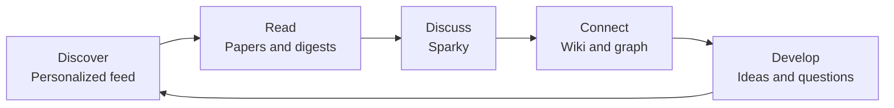
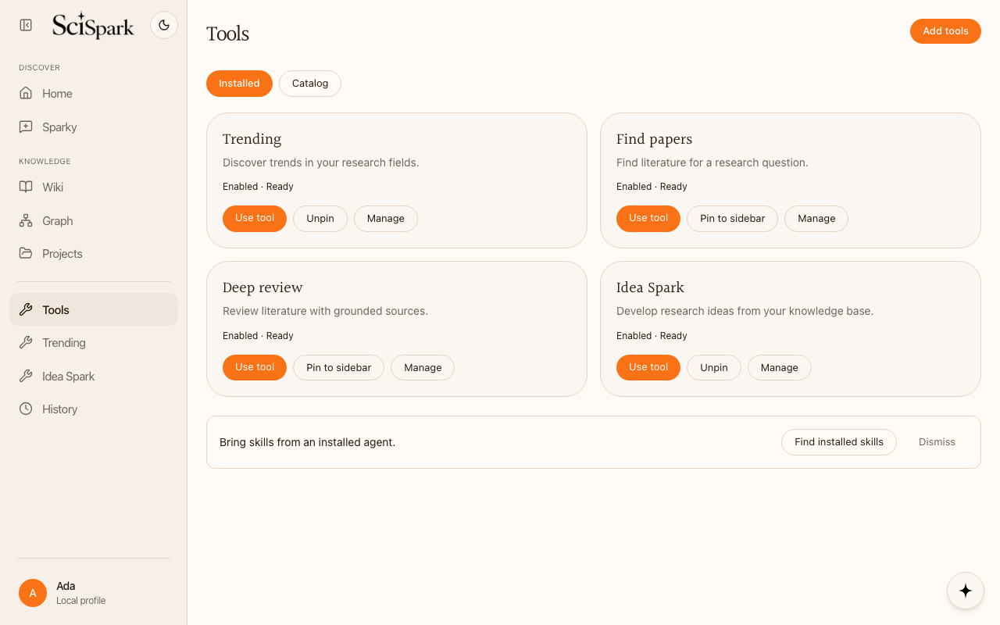

<a id="top"></a>

<div align="center">


### Discover papers. Connect knowledge. Develop ideas.

**SciSpark is a local-first, modular workspace for reading papers, building knowledge, and doing research.**

[](LICENSE)
[](#current-status)
[](#your-data-and-models)

[Core workspace](#core-workspace) · [Research tools](#research-tools) · [Bring your own skills](#bring-your-own-skills)<br>
[Getting started](#getting-started) · [Current status](#current-status) · [Development](#development)

</div>

---

Follow your research interests, understand papers with Sparky, and turn what you
learn into a connected knowledge base. Return to your sources and conversations
as new questions take shape.

Your papers, conversations, and saved results stay together in a local vault.
The core workspace is ready by default. Extend it with optional research tools,
supported open-source workflows, and your own academic skills.

## Core workspace

These features are available by default, without installing research tools.
AI features use the connection you configure.

| Feature | What you can do |
|---|---|
| **Personalized Feed** | Discover papers around your interests, see why they were recommended, and choose whether feedback informs future recommendations. |
| **Paper reading and digests** | Read available full text, highlight passages, and generate a digest from the available source material. |
| **Sparky chat** | Discuss research, ask about the paper you are reading or a selected passage, and return to saved conversations. |
| **LLM-wiki** | Turn papers and notes into linked knowledge with source references, editable pages, and undoable changes. |
| **Graph** | Explore relationships, timelines, citations, and collaboration across your saved research. |
| **Projects and History** | Organize work around a question and revisit conversations, tool runs, results, and changes. |

### From a paper to your next question


```mermaid
flowchart LR
    D["Discover<br/>Personalized feed"] --> R["Read<br/>Papers and digests"]
    R --> S["Discuss<br/>Sparky"]
    S --> K["Connect<br/>Wiki and graph"]
    K --> Q["Develop<br/>Ideas and questions"]
    Q --> D
```

Open a paper from your feed, read its digest, and ask Sparky about a passage.
Keep useful findings in your wiki, explore their connections in the graph, and
bring the next question back to your research. Projects organize the work;
History lets you pick up where you left off.

Move between these activities as needed. Optional tools can support any stage:
find more papers, investigate a field, compare evidence, or develop an idea.

## Research tools

**Tools** is where you add and manage optional workflows. New profiles start with
the core workspace; existing profiles retain their built-in tools and saved work.

| Built-in tool | Purpose |
|---|---|
| **Trending** | Follow topic activity and highly cited papers in the fields you select. |
| **Find papers** | Search scholarly sources for a research question. |
| **Deep review** | Turn an approved brief into a cited, versioned literature-review draft. |
| **Idea Spark** | Develop idea seeds and research proposals from your knowledge base. |

Enable only what you want. Pin frequently used tools to the sidebar, configure
model overrides and usage limits, and disable a tool without losing its saved runs.



*Four built-in tools enabled in an example profile. Pin the ones you use most.*

### Choose a tool directly or ask Sparky

Open a tool from **Tools**, or describe what you want in Sparky. When your request
clearly matches one enabled, ready tool, Sparky can start it. When several tools
fit, it asks which one to use. Naming a tool selects that implementation; if it
needs setup, Sparky offers setup instead of silently substituting another tool.

You can keep several tools for the same purpose—for example, the built-in Deep
review and an imported literature-review workflow. One chosen tool owns each run;
its supporting skills share the run's context and usage limits. Native Deep review
still asks you to approve its editable brief before research begins.

## Bring your own skills

Use **Add tools** to review and import supported research workflows from:

- A GitHub repository.
- A local folder or ZIP, including skills you downloaded or wrote yourself.
- Skills already installed in Codex, Claude Code, or another agent.

For installed agent skills, **Find installed skills** asks permission to inspect
selected locations. You choose which skills to import into the current profile.
SciSpark does not copy the agent's credentials or unrelated hooks. Discovery and
import do not start a research run.

Review the workflows, supporting resources, connections, and setup requirements
before confirming an import. Compatibility is checked separately: downloading a
tool or finding its `SKILL.md` does not make it runnable. Tools use SciSpark's shared
chat, results, and wiki surfaces; arbitrary third-party frontend pages are not supported.

The catalog includes reviewed integrations for OpenCite and a multi-skill
literature-review workflow from `neuromechanist/research-skills`. The latter
requires the exact OpenCite dependency to be imported separately. Their current
execution limits are described under [Current status](#current-status).

Updates are applied when you choose, with rollback available. Active runs retain
the versions and settings they started with.

### Saved progress and results

Accepted tool runs continue when you navigate away, reload, or close the browser,
provided the local SciSpark runtime stays running. Reopen a run through History
to follow progress. A stopped computer cannot continue local work; interrupted
runs retain their progress and may need an explicit recovery decision.

Run outputs are saved automatically. Reports, paper lists, citations, and supported
files can be previewed or downloaded. Use **Add to wiki** to keep useful results
in your knowledge base; an explicit request to update the wiki can authorize that
write as part of the run. Supported wiki changes can be undone.

Limits apply to the whole run, including supporting skills. Continue can add
allowance without resetting earlier usage. SciSpark asks before repeating uncertain
work that might consume more usage or duplicate a change.

## Getting started

Requirements: **Node.js 22.12+**, **npm**, and an API connection or a signed-in
**Codex / Claude Code CLI** for AI features.

From your SciSpark source checkout:

```bash
npm install
npm run dev
```

Open **[http://127.0.0.1:3000](http://127.0.0.1:3000)**.

1. Create or select a local profile.
2. In **Settings → Connect your AI**, choose your connection and models.
3. Set your research interests and start your feed.
4. Open a paper, generate a digest, or ask Sparky about it.
5. Visit **Tools** when you want to add a research workflow.

For a production-mode local preview:

```bash
npm run build
npm run preview
```

The supplied server commands bind to loopback. This preview is intended for use
on your own computer, not as a shared public server.

## Your data and models

Each local profile has its own vault, research settings, AI connections, enabled
tools, and usage history. The default vault is `~/SciSpark/vault`; use
`SCISPARK_VAULT` to select another starting location. New profiles create separate
vaults. Logging out returns to the profile chooser without deleting saved work.
Local profiles do not provide encrypted storage or protection against other
people using the same computer.

The browser is the interface; the local runtime owns storage and AI requests.
Research is stored as Markdown, source assets, and structured records. Stored
provider keys are not returned to the browser.

Choose an API provider or a supported local agent connection. Tools inherit your
selected models unless you configure an override. SciSpark does not silently
switch providers or fall back from subscription usage to API billing. Subscription
engines use their account limits; dollar costs are not reported for those calls.

Local storage does not mean all computation is offline. Your selected scholarly
sources and model providers receive the requests and context needed for the work
you run. Feed and search support arXiv, OpenAlex, Semantic Scholar, and PubMed;
individual tools can have additional connection requirements.

## Current status

**Developer preview.** The modular workspace implementation has passed its
recorded offline tests and browser checks, including navigation, profile isolation,
server restart, tool selection, and saved results.

Imported command tools require verified isolation and a prepared environment.
The actual isolation probe failed on the macOS validation host, so command tools
such as OpenCite remain unavailable there. Linux and Windows execution, real
managed installation, and live imported-tool provider/source integrations remain
unverified. The imported literature-review evidence uses synthetic fixtures; it
does not establish real research quality.

See the [validation record](docs/testing/2026-10-05-modular-workspace.md) for exact
results, remaining gates, and screenshots, and the
[live-check protocol](docs/testing/modular-workspace-live-check.md) for separate
integration acceptance.

## Development

SciSpark uses Next.js App Router, React, TypeScript, Tailwind CSS, and a
filesystem-backed vault. Tools use versioned manifests, profile-specific settings,
server-owned workflow coordination, retained artifacts, and metered attempts.
Graph views use Sigma.js and Graphology; reading uses pdf.js and DOMPurify.

```bash
npm test
npx tsc --noEmit
npm run lint
npm run build

# Browser checks use a disposable vault.
npx playwright install chromium
npm run e2e
```

Live provider tests are separately gated and may consume paid or subscription
usage. They are not ordinary unit tests.

| Documentation | Purpose |
|---|---|
| [Feature guide](docs/FEATURE_GUIDE.md) | Current behavior, source access, tools, recovery, and usage controls. |
| [Modular workspace design](docs/superpowers/specs/2026-10-05-modular-workspace-design.md) | Product decisions, architecture, and current implementation boundaries. |
| [Validation evidence](docs/testing/2026-10-05-modular-workspace.md) | Reviewed commits, test results, screenshots, and open acceptance gates. |
| [Engineering conventions](agents.md) | Stack, commands, browser/server boundaries, and contribution rules. |
| [Design system](design.md) | SciSpark's visual and interaction conventions. |

When contributing, preserve source provenance, profile isolation, durable progress,
and undoable vault changes. Add focused regression tests for behavior changes and
use disposable data for browser checks.

## Acknowledgments and license

SciSpark builds on open research and software. Key contributions and references include:

- **LLM Wiki and Andrej Karpathy's LLM Wiki pattern:** references for a persistent, linked research knowledge base.
- **Ai2 ScholarQA:** an attributed TypeScript adaptation informs the native deep-review pipeline. Its [license](third_party/scholarqa/LICENSE) and [notice](third_party/scholarqa/NOTICE) are retained.
- **Microsoft ResearchStudio:** bundled ideation-pattern cards and research-idea disciplines, with [license](src/lib/spark/pattern-cards/LICENSE) and [notice](src/lib/spark/pattern-cards/NOTICE.md).
- **neuromechanist/research-skills and OpenCite:** pinned catalog resources and reviewed integrations, with their [research-skills license](src/lib/extensions/catalog/opencite/research-skills-LICENSE), [OpenCite license](src/lib/extensions/catalog/opencite/opencite-LICENSE), and [Humanizer attribution](src/lib/extensions/catalog/literature-review/humanizer/LICENSE).
- **PaperFlow and PAHF:** design references for research discovery and optional feedback learning.

SciSpark's original code and documentation are licensed under
[Apache-2.0](LICENSE). Third-party components retain their own licenses and notices.

Copyright 2026 SciSpark contributors.

[Back to top](#top)
